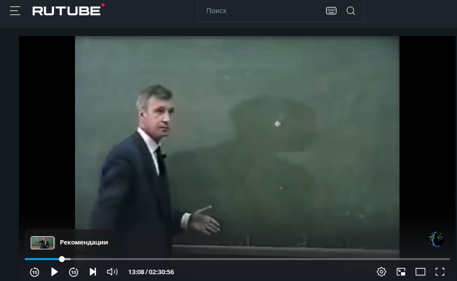
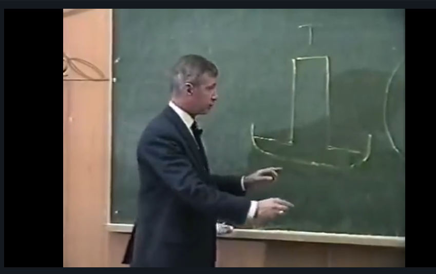

# Классическая наука о сознании: факты и понятия. Структура сознания и его свойства. Различия представлений о сознании. Возможности и ограничения метода интроспекции.

Первым прибором для изучения сознания был метроном - слушаем метроном и фиксируем естественное свойство сознания - ритмичность. Ритмичность, в более широком смысле, значит организованность впечатлений, связность впечатлений.
Если сознание можно изучать с помощью интроспекции, значит у Вундта есть модель.
Сознание можно представить как структуру, напоминающую поле зрения. Можно изобразить как окружность, есть периферия и центр, центр - фокус сознания.
Замечание: модель структуры сознания напоминает сетчатку глаза. Первая психология называется физиологическая психология, потому что модель сознания напоминает физиологический орган.

Если сознание - это структура, состоящая из элементов. Можно ставить вопросы сколько вмещает элементов, различны ли они.

------------------------------------------------------------------------------------------------------------------

Философия - условие для возникновения наук, философ создает эти условия, рискуя понять неизведанное.

Предмет - сознание, метод - интроспекция.
## Модель сознания по Вундту
Сознание можно представить как поле зрения
 - у сознания есть фокус (центр) и периферия

Объем сознания - это количество связанных между собой элементов(простых впечатлений), которое испытуемый в данное время воспринимает как единое целое.

Каков обьем сознания?
Испытуемый слышит метроном, не считает удары, предлагаем разное кол-во пар, он отвечает где больше или меньше.
Если при каком-то определенном наборе он больше не ошибается, то его он может целиком содержать в структуре сознания.

Вначале получили: 16-40 простых впечатлений (разброс потому что связаны элементы по-своему у кого 2 у кого 4 удара выступающие единицы)
Решили попросить выделить сам элемент (уточнить единицу). Если испытуемый сосредоточил усилие в фокусе, то вокруг центра есть область где элементы получают особое свойство (поле внимания - центральная часть)
А каковы свойства элементов в поле внимания?
- ясность (чувственная ясность)
- отчетливость - отделенность элементов от подобных соседних (различаемость)

Ученик Вундта Эдвард Титчинер предланает модель сбоку (шляпа-цилиндр с основанием) - волна внимания

Внимание по Титчинеру - основное свойство сознания (сенсорная ясность)
В центре элементы ясны, на периферии - смутны

Объем внимания - это кол-во элементов, которые испытуемый в данный момент воспринимает ясно и отчетливо (в результате экспериментов Вундта 3-6)

А можно ли расширить обьем внимания? - нельзя, но на каждом месте впринципе можно образовать другую единицу.
Образовывать единицу - связывать элементы между собой (ассоциации - пространственные, временные, смысловые итп)

Сознание - не статичная структура, она может меняться, есть силы, которые тянут вовне или к центу.
за границей -> в периферию - перцептивные силы
периферия -> внутренняя граница - апперцептивные силы (управляют вниманием)
У апперцепции несколько определений
1) Процесс, в результате которого элементы сознания становятся ясными и отчетливыми
2) Процесс преобразования (укрупнения) единиц сознания
Пример (пример простейший для понимания):
Суть: в немецком языке есть слова из букв > 6, 10, 12
Берем такое слово и просим испытуемого достигать ясности и отчетливости каждой буквы
7-я буква может вытолкнуть первую итд
Как правило в этот момент испытуемый вдруг осознает что это не набор букв, а слово, буквы связаны между собой по смыслу, то все даже почти упавшие и еще не предьявленые буквы попали в центр внимания - единица стала более крупной
Аперцепция по результату - это ясность и отчетливость в центре (с обьективной стороны), а с субьективной стороны возникает чувство деятельности, усилия, работы

## Развитие представлений о сознании

Рассмотрим два направления
1) Психологии сознания
2) Современное (Уильям Джемс) соглашаясь с Вундтом говорит - сознание - не только структура, но и процесс и вводит понятие "Поток сознания". 
Замечание: Модель Титчинера - это не двумерная модель, это - волна, внимание во времени изменяет интегсивность.
Джемс меняет модель, его основное понятие - поток сознания

Классические модели сознания - про сознание с усилием (думаешь специально)
Поток сознания (что-то сознается, ощущается итп, непроизвольная активность)
Практически каждый может наблюдать поток в измененных состояниях сознания (переходных из одного состояния в другое, например когда засыпаем и просыпаемся, когда засыпаем в сознании непроизвольно протекают впечатления: дневные, о прошлом, забегания в будущее)
Свойства потока сознания:
1) Индивидульность - каждое впечатление в потоке стремится стать личным (частью личного сознания, пройти через субьект), у каждого поток сознания свой
2) Непрерывность - неделимость на части, каждое впечатление не разделено с другим, одно как бы набегает на прошедшее, эти впечатления всегда даны в контексте рядом с соседними, такие группы нельзя разделить. Если отвлечся и вернуться - поток проджолжается
3) Неповторимость впечатлений - предположим человек вспоминает о чем то важном, навязчивое впечатление повторяется несколько раз подряд. Каждый раз это впечатление помещается в новый контекст, это означает что каждый раз в данном впечатлении субьекту открывается нечто новое
4) Избирательность или направленность потока - впечатления в потоке не равны по значимости (разной интенсивности), раз они не одинаковы, то те что сильнее зададут направление потоку в целом. Модель Джемса - ручей, протекающий по равнине и прокладывающий себе русло. Избирательность - это отбор или селекция. Отбор и селекция - также избирательность внимания, селекция впечатлений.

Здесь надо упомянуть Улисс Джеймса Джойса. Джеймс Джойсс попытался описать поток сознания трех людей, и для этого он создал 18 новых литературных форм. В поздней версии в описании пропали знаки припинания, да и сами расстояния между словами пропали.
Эти классические представления о сознании именуются Ассоцианизмом.

### Гештальт

Вундт дал основание считать, что сознание - это сумма элементов. Целое - сумма частей. И возникает направление, выходящее за рамки классики - Гештальт.
Гештальт переводится как "Целостная форма", структура, целостная организация
Гештальт - есть целое, не сводимое к сумме частей.

Перечислим некоторых представителей Гештальт психологии
1) Макс Вертгаймер - к нему применил слово "самоактуализация" Маслоу
В 1912 году он выпускает работу по Гештальт психологии.
Замечание: для людей двадцатого века возникла новая наука и искусство, возникли они в прошлом веке, а стали нужны в настоящем (психология и кино). Макс Вертгаймер начал с исследования техники кино. Он купил стробоскоп и провел такой опыт.
Основной опыт Вертгаймера
Предьявляем испытуемому в полной темного две светящиеся точки, предьявляем их попременно (зажглась одна, потом вторая, между зажиганием есть интервал 200мс). Испытуемый поначалу видит две светящиеся точки, но если временной интервал уменьшить до 30мс, то испытуемый видит две непрырывно горящие точки. Две точки -это два элемента. Но вот возникает промежуточная ситуация 50 или 100мс, тогда испытуемый перестает видеть элементы (две точки), но видим движущуюся точку из одного положения в другое. Когда что-то движется достоточно быстро мы даже не видим что движется, мы видим чистое движение. Данное явление называется греческой Фи - феномен, феномен кажущегося движения.
Разве в сумме двух точек содержалось новое качество - движение? нет , это и есть гештальт

Гештальт - это феномен, обладающий особым качеством по сравнению с суммой своей частей (движение - это новое качество - его не получишь из двух точек). Видим то мы на самом деле только гештальты, мы отдельных чистых ощущений в обыденной жизни не выделяем. Фигура и фон - слова из гештальт психологии. Вертгаймер открыл главное и слово гештальт пошло в другие области психологии, прежде всего гештальт психологов интересовало мышление, а психологов практиков интересовало как представить личность через гештальт

2) Вольфганг Кёлер
Предложил термин инсайт
Келер был в свое время отправлен на далекий остров и изучал там человекоподобных обезьян. Не будем забывать что этот терси был впервые предложен для обьянения поведения животных.
В русском есть слово видеть и понимать, бывает так чмотрел на разнородное скопление обьектов, элементов сознания, а потом неожиданно что-то новое бросилось в глаза, можно перевести инсайт как заметил, бросилось в глаза, увидел целостную новую структуру, обьединил в целое.
Опыт Кёлера с шимпанзе:
Испытуемый находится в вольере, за границей вальера лежит приманка - банан, лапой достать нельзя.
А в самом вальере лежит палка подходящей длины чтобы достать приманку.
Лапа, приманка, длинная палка отделены друг от друга.
В поведении испытуемого можно выделить 3 стадии
1) Беспорядочная поведенческая активность - беспорядочно носится по клетке
2) Стадия бездействия - испытуемый устал, сел в углу вольера и рассматривает ситуацию, сказать думает - нельзя, это нельзя проверить. Все необходимое для решения должно быть в едином зрительном поле. Тогда может наступить 3я стадия - инсайт
3) Инсайт - шимпанзе быстро вскакивает, хватает палку и достает приманку. Инсайт - качественное изменение в поведении.

Очевидно что ни о какой интроспекции речи не идет, так как испытуемый - животное, здесь другой метод.
Метод феноменологический - исследование того что можно увидеть, наглядно представить. Описание и обьянение здесь одновременно, предполагают друг друга. Описать условия возникновения феномена. Описали = обьяснили. 
Правильным переводом термина инсайт будет понимание ситуации. Ресь не о том что происходит в сознании, а о том как может обьянить данный факт исследователь.
Инсайт (понимание) - такая целостная организация всех элементов проблемной ситуации, которая позволяет обнаружить и устранить основной конфликт.

Примеры, поясняющие что слова понимание (инсайт) и решение - не одно и то же:
1) Понимание без решения (хорошая[целостная] ошибка)
Возьмем и уберем палку от решившего задачу в предыдущий раз Шимпанзе. В вольере может находиться что-то еще, он начинает все это собирать и по отдельному кусочку подталкивать к приманке, он выложил все это до приманки (несуществующая по функции палка). Понимание есть но нет результата. Нередко из этого подлапного материала все таки делает палку. Но все же.
2) "Решение" без понимания (глупый шимпанзе)
Пусть приманка висит на потолке. А в вольере расположены ящики. Тогда испытуемые, способные к решению подобных задач, выставляют ящики, прыгают и хватают/сбивают банан. Глупый шимпанзе наблюдает, видит - они прыгают, он начинает подражать - прыгать, но достать приманку не может, дело навреное в ящиках, в стороне от приманке составляет ящики в пирамиду и может даже прыгать по ним. Но решения нет, все по частям - нету целостной организации.

История про экзаменатора за что три простите я что не прыгал и пирамида была длиннее.

Основатель гештальт терапии Фриц Перлз пытается применить гештальт психологии к работе с пациентом.
Личность не сводится к сумме своих свойств, они организуются в целое, и если у человека маленькое проблема, то это целое, состоящее из частей надо преобразовать, переструктурировать.

Упражнения из гештальт терапии:
1) Хочешь понять себя - живи сейчас, скажет философ.
Замечай то что происходит сейчас.
Перлз предлагает понять это буквально.
Упражнение безопасно для тех кто не умеет его выполнять.
Возьмите листочек бумаги и напишите "Здесь и сейчас я" и дальше что-то начинаем себе замечать, ведь инсайт - заметить. Поработать немножко, возможно будет инсайт. Это ни в коем случае не интроспекция, не надо ничего делить на части.
У пациентов Перлза бывало так: начинает что-то писать, а во второй строчечке уже начинается я вспоминаю что вчера, а потом что завтра. Вот вы на первой же строчке ушли из настоящего.
Перлз говорит тревожность - это необоснованное забегание вперед, представил себе на том месте где тебя пока нет, тревожность это вообще то говоря скованное дыхание, сковала тревога. Палец учителя медленно движется по классному журналу, а в классе уже мертвая тишина. А зачем, разве палец учителя остановился на вашей фамилии? Перз советует постоянно задавать себе вопрос - где я? Я за партой, где я скоро буду у доски, я сейчас у доски - нет, так зачем я в тревоге? Тревога уйдет, и когда уйдут негативные реакции, откроются позитивные - интерес к предмету или взволнованность предметом, а это совсем другое состояние, чем тревога.
2) Фигура и фон.
Когда мы выделяем что-то как фигуру, мы эту фигуру выделяем несколько преувеличенной, она больше чем на самом деле. Небольшие личностные проблемы это как правило подчеркивание фигуры, а решение в фоне. Перлз предалагет попробовать:
рядом с письменным столом висит картина, а потом она поднадоела и хочу увидеть в ней что-то новое и тогда я могу посмореть на картину и мысленно обвести ее по контуру - он один и у фигуры и у фона, когда фигура - гештальт - контур принадлежит фигуре. А теперь попробуем приставить что фон - это фигура и это контур фона. Мы как бы не видим фигуру, пытаемся заметить фон. В этот момент, когда обращаешь внимание на фон, может в фигуре появиться что-то новое.
Ожидание транспорта - опаздываю, автобус - фигура, жду когда придет. От вашего беспокойства приход автобуса не зависит. Автобус не придет раньше по желанию и от тревоги и тогда у вас есть время, вы можете забыть о фигуре и наблюдать фон - лица людей, они тревожаться, посмотрите на себя со стороны, посмотрите на деревья. Вот еще что-то появилось, скажем это автобус, пожалуй стоит в него войти.

## Возможности и ограничения метода интроспекции

### Возможности
Определение свойст, элементов сознания, установление ассоциаций и их закономерностей.
Основное правило метода интроспекции (Эдвард Титчинер. Интроспекция Титчинера - аналитическая) - ошибка стимула(предмета). Не стоит называть предмет, который вызывает наше ощущение. Вундт говорит: предмет нельзя называть потому, что название - это значение. Описывать надо непосредственно ощущение. Описывать не пользуясь никакими иными средствами, а название предмета - средство.

Есть такое произведение писателя Саши Соколова "Школа для дураков" как школа игры на фортепиано итд, он попытался описать мир глазами такого субьекта, который заведомо неверно представляет значение предмета. Начинается с того что это вроде бы пишет ребенок, потом вроде умственноотсталый, а потом выясняется что это и не ребенок вовсе.

Интроспекцию забыли и казалось надолго, и вот сравнительно недавно (в 20 веке) на фоне интереса к восточным психотехникам (медитация - суть в том что некий обьект рассматривается долго для того, что когда проявляешь к нему внимание обьект как бы разделяется на части и их можно наблюдать). Экспериментальный метод титченера - по сути идеальная техника медитации.

### Ограничения (от очевидных к дискуссионным)
1. Изучать и наблюдать можно только собственный опыт. Невозможно изучение детской психики. - Титчинер (об это мало кто знает) говорил о том что интроспекция применима к детям и животным, можно подставлять себя.
2. Интроспекция может искажать исходные психические впечатления. Навыки интроспекции могут быть разные. Испытуемого обучили, он теперь говорит вам о том что требует ваша теория.
3. Методу интроспекции отказали в обьективности. (для того чтобы такое обвинение нанести, надо заранее иметь другое представление об обьективности(современное)). Данные не надежны, испытуемый может ошибаться. Ответ классика: да, источник данных в данном методе конечно субьективный, иначе быть не может, так как это наука о человеке, субьекте, но метод обьективен в том смысле, что он полностью отвечает научным требованиям своего времени.

# Проблема обьективности в психологии. Предмет и задачи психологии поведения. Общее представление о научении и его видах. Понятия промежуточной переменной и когнитивных (познавательных) карт.

## Проблема обьективности в психологии. (что считать обьективным, принимать в качестве факта)
Решения проблемы:
1) Обьективно то, что можно наблюдать извне (если субьективное было связанно с внутренним, то значит обьективное должно быть связанно с чем-то внешним)
2) Обьективно содержание таких понятий, которые необходимы для обьяснения внешне наблюдаемого поведения.
3) В психологии следует считать обьективными такие сознательные(психические) представления, которые включены в практику, реальную жизнь, необходимы для ее осуществления

Основной критик психологии сознания - американский исследователь Джон Уотсон, он отказывает в обьективности методу интроспекции и говорит о требованиях к изучаемому явлению:
1) Должно быть внешне наблюдаемым
2) Должно быть повторяемым (воспроизводимым) в одних и тех же условиях
3) Желательно фиксировать это явление с помощью прибора

Далее он рассуждает: возьмем сознание, все эти отчеты, оно отвечает этим требованиям, конечно нет.
Уотсон сказал: сознания как предмета науки нет!
А есть как предмет- поведение и метод - исследование внешне наблюдаемой двигательной активности

## Предмет и задачи психологии поведения

